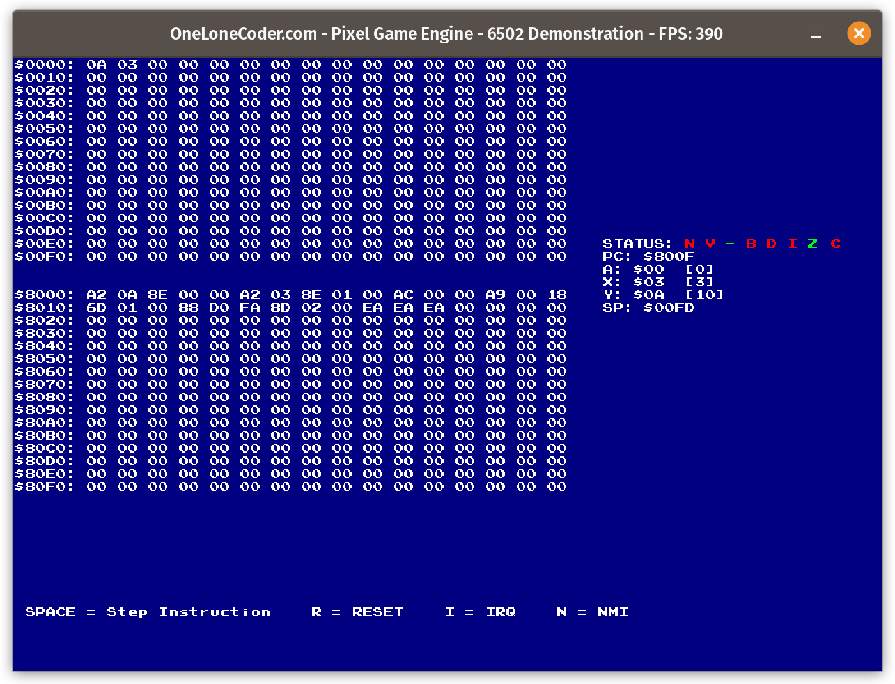

# 6502 CPU Emulator

## The 6502 CPU

The 6502 CPU is an 8-bit microprocessor designed by MOS Technology. It was a very popular in the 1970's and 1980's. Popular game consoles in those era such as Atari 2600, Atari 8-bit family, Apple II, Nintendo Entertainment System (NES) etc.

This project aims to emulate the 6502 implementation as seen on the Nintendo Entertainment System (which is still basically a 6502 CPU). This was done mainly to gain a deeper understanding of C++ programming, how a CPU works and knowledge about computer architectures. More info on this microprocessor can be found in the [Wikipedia](https://en.wikipedia.org/wiki/MOS_Technology_6502) page.

## Screenshots



The above screenshot displays a visualisation of the status of the CPU registers, as well as the different pages in the RAM,which includes the loaded program and the results of tne operations.

## Build Instructions

### Linux

To compile from the terminal, from the root directory, run:
```bash
make
```
To run the program:
```bash
./6502CPU
```

### Windows

To install the compiler and make, follow the guide [here](https://code.visualstudio.com/docs/cpp/config-mingw)

To compile from CMD/Powershell, from the root directory run:
```bash
make
```
To run the program from Command Prompt:
```bash
6502CPU.exe
```
To run the program from Powershell:
```bash
.\6502CPU.exe
```
Or you can double click on the .exe file to open the program
## Libraries/Utilities used

An amazing utility from One Lone Coder, the [olcPixelGameEngine](https://github.com/OneLoneCoder/olcPixelGameEngine) was used to visualise the results of the emulation.

## Special Thanks

- https://github.com/OneLoneCoder/olcPixelGameEngine
- [javidx9 YouTube Channel](https://www.youtube.com/c/javidx9)
- https://www.masswerk.at/6502/6502_instruction_set.html
- https://www.masswerk.at/6502/disassembler.html
- https://www.nesdev.org/wiki/CPU
- https://www.youtube.com/watch?v=fWqBmmPQP40&t=34s